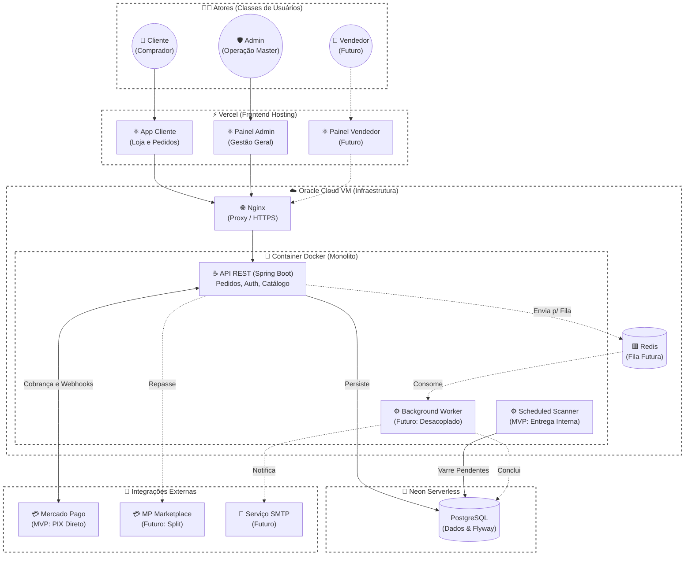

# Arquitetura

Este documento resume a arquitetura atual do The Pirate Max para leitura de portfolio e manutencao tecnica.

## Visao geral



## Frontend

O frontend principal fica em `frontend-app/`.

Responsabilidades:

- renderizar catalogo, categorias e detalhes de produto;
- gerenciar sessao de usuario;
- manter carrinho;
- criar pedidos;
- exibir pedidos do cliente;
- fornecer painel administrativo para operacao interna.

Stack:

- React;
- Vite;
- TypeScript;
- React Router;
- assets otimizados em WebP.

## Backend

O backend fica em `backend/` e usa Spring Boot.

Responsabilidades:

- autenticacao e autorizacao;
- catalogo de produtos;
- criacao e consulta de pedidos;
- controle de estoque de credenciais;
- operacoes administrativas;
- integracao de pagamento;
- webhook de pagamento;
- migracoes de schema com Flyway.

Camadas principais:

- `api`: controllers e contratos HTTP;
- `domain`: entidades e enums de negocio;
- `repository`: persistencia via Spring Data JPA;
- `service`: regras de negocio;
- `config` e `security`: configuracao, CORS, JWT e filtros.

## Banco de dados

O projeto usa PostgreSQL, com migracoes versionadas em `backend/src/main/resources/db/migration`.

Entidades centrais:

- usuarios;
- produtos;
- categorias;
- pedidos;
- itens de pedido;
- pagamentos;
- credenciais;
- registros de auditoria.

## Infraestrutura

O modelo de deploy atual usa:

- Vercel para o frontend;
- Oracle Cloud VM para o backend;
- Docker para empacotar a API;
- Nginx como reverse proxy;
- Certbot/Let's Encrypt para HTTPS;
- Neon PostgreSQL como banco remoto.

## Fluxo de compra

```text
Cliente acessa o catalogo
  -> adiciona produtos ao carrinho
  -> cria conta ou faz login
  -> cria pedido
  -> pedido reserva ou referencia estoque
  -> pagamento e iniciado
  -> webhook confirma pagamento
  -> backend entrega credenciais
  -> cliente consulta pedido e credenciais
```

## Pontos de atencao

- O webhook de pagamento precisa ser validado em ambiente definitivo antes de venda real.
- Credenciais e segredos nao devem aparecer em logs, commits ou mensagens de erro.
- Operacoes administrativas devem manter auditoria.
- Backup e observabilidade ainda devem ser fortalecidos para operacao real.

