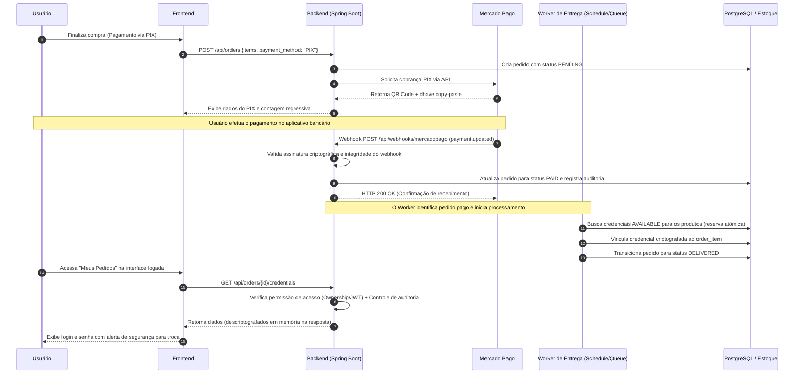

# The Pirate Max — Documento Master de Arquitetura e Contexto

---

## 1. Visão Geral

O **The Pirate Max** foi concebido como uma plataforma full stack de marketplace digital com checkout financeiro via PIX e entrega automatizada de credenciais e acessos digitais após a confirmação bancária.

Pelo fluxo e arquitetura consolidados no projeto, o ecossistema combina:
- **Frontend** interativo para catálogo, carrinho, checkout e área do cliente ("Meus Pedidos").
- **Backend** robusto estruturado em Java 21 e `Spring Boot 3.4.4`.
- **Integração Financeira** com gateway `Mercado Pago` (geração de PIX dinâmico e processamento de webhooks).
- **Desacoplamento Assíncrono** com fila para isolar a latência bancária da entrega do produto.
- **Worker de Entrega** automatizado com controle de concorrência, idempotência e criptografia.

A arquitetura foi pensada desde o início para alta escalabilidade e segurança operacional, separando a confirmação transacional do pagamento da alocação de estoque e entrega do produto digital.

---

## 2. Objetivo do Produto

O objetivo central do projeto é permitir que o usuário experimente uma jornada de compra sem atritos:
1. Selecionar produtos de um catálogo digital (streaming, games, IA, licenças de software, contas digitais).
2. Finalizar a compra instantaneamente via PIX com geração de QR Code e chave *copia-e-cola*.
3. Receber a confirmação de pagamento de forma 100% automatizada em poucos segundos.
4. Acessar suas credenciais e chaves de licença com máxima segurança na área logada.

Em termos operacionais, o sistema prioriza quatro pilares:
- **Confiabilidade**: Garantia no recebimento e processamento de webhooks.
- **Consistência**: Máquina de estados transacional inviolável para os pedidos.
- **Idempotência**: Prevenção de entregas duplicadas ou vazamento de estoque em cenários de reprocessamento.
- **Segurança**: Proteção rigorosa das credenciais (criptografia AES-GCM em repouso e descriptografia apenas em memória no ato da consulta).

---

## 3. Fluxo Principal Atual

O ciclo de vida principal (comprador $\rightarrow$ pagamento $\rightarrow$ worker de entrega) segue as seguintes etapas:



---

## 4. Arquitetura Base e Camadas

### Frontend (`React 18` + `Vite 7` + `TypeScript`)
Responsabilidades da interface de usuário:
- Exibição de catálogo fluido categorizado e carrinho de compras.
- Tela de checkout com monitoramento de tempo de expiração do PIX.
- Painel do cliente ("Meus Pedidos") com visualização protegida de credenciais.
- Painel Administrativo ("Admin Dashboard") para gestão de produtos, estoque de credenciais, reprocessamento e auditoria de pedidos.
- Comunicação centralizada via client HTTP (`src/shared/api/client.ts`) com tratamento unificado de erros, tokens JWT e *X-Request-Id*.

### Backend (`Java 21` + `Spring Boot 3.4.4`)
Responsabilidades do núcleo transacional:
- API RESTful estruturada com validação rigorosa (*Bean Validation*).
- Autenticação e autorização via Spring Security com tokens JWT Stateless e controle de taxa (*Rate Limiting Filter*).
- Persistência e modelagem relacional via Spring Data JPA e migrações versionadas com `Flyway`.
- Integração nativa com APIs do Mercado Pago (modo simulação local e modo real).
- Criptografia simétrica robusta de credenciais (`CredentialCryptoService`) com suporte a rotação de chaves (*Key Versioning*).

### Fila e Desacoplamento (`Redis` / Scheduled Workers)
Responsabilidades no ecossistema:
- Absorver picos de requisições financeiras sem sobrecarregar a base transacional.
- Isolar o tempo de resposta HTTP 200 OK do webhook bancário do tempo computacional de alocação de estoque.
- Garantir tentativas automáticas de reprocessamento em caso de falha temporária no estoque ou banco.

### Worker de Entrega (`OrderDeliveryService`)
Responsabilidades do worker assíncrono:
- Monitoramento contínuo por polling/schedule de pedidos no estado `PAID`.
- Reserva atômica de credenciais marcadas como `AVAILABLE` em estoque para os itens do pedido.
- Transição segura do pedido para `DELIVERED` ou sinalização de falha por falta de estoque (`DELIVERY_FAILED`).

---

## 5. Entidades Principais

| Entidade | Campos Chave | Descrição |
| :--- | :--- | :--- |
| **`Product`** | `id`, `sku`, `slug`, `name`, `price_cents`, `status`, `delivery_type`, `requires_stock` | Catálogo de itens disponíveis para compra com controle de vigência (`duration_days`) e fornecedor. |
| **`CatalogCategory`** | `id`, `name`, `slug`, `sort_order`, `active`, `legacy_category` | Categorização visual e estrutural do catálogo (Games, IA, Streaming, Licenças, etc.). |
| **`Credential`** | `id`, `product_id`, `login_encrypted`, `password_encrypted`, `status`, `encryption_key_version`, `source_batch` | Estoque de acessos digitais criptografados em repouso. Transiciona entre `AVAILABLE`, `RESERVED`, `DELIVERED` e `INVALID`. |
| **`Order`** | `id`, `user_id`, `status`, `total_amount_cents`, `payment_method`, `external_reference`, `idempotency_key`, `timestamps` | Pedido de compra unificando os itens, o histórico transacional e a referência de pagamento externa. |
| **`OrderItem`** | `id`, `order_id`, `product_id`, `quantity`, `credential_id` | Item individual da compra, vinculando o produto encomendado à credencial exata alocada pelo worker após a entrega. |
| **`Payment`** | `id`, `order_id`, `provider`, `provider_payment_id`, `status`, `qr_code`, `qr_code_base64`, `raw_payload` | Registro financeiro de auditoria e controle de cobrança gerado pelo provedor (Mercado Pago). |
| **`User`** | `id`, `email`, `name`, `password_hash`, `role` (`ADMIN`, `CUSTOMER`), `status` | Usuários da plataforma, distinguindo clientes consumidores de administradores de sistema. |

---

## 6. Máquina de Estados Recomendada

A consistência do sistema depende de transições de estado estritamente controladas:

### Estados do Pedido (`OrderStatus`)
- `PENDING`: Pedido criado no checkout; aguardando confirmação do pagamento pelo banco/gateway.
- `PAID`: Pagamento confirmado via webhook bancário; aguardando o processamento do worker de entrega.
- `DELIVERY_PENDING`: Reserva de itens em andamento ou entrega parcial em processamento.
- `DELIVERED`: Todas as credenciais foram alocadas e associadas; o pedido está liberado para consulta pelo cliente.
- `DELIVERY_FAILED`: Ocorreu uma falha operacional após o pagamento (ex: falta de estoque de credenciais para o SKU).
- `CANCELED`: Pedido expirado por tempo sem pagamento ou cancelado pelo cliente/sistema.
- `REFUNDED`: Pagamento devolvido financeiramente ao cliente.

### Estados da Credencial (`CredentialStatus`)
- `AVAILABLE`: Pronta e livre no estoque para ser alocada a uma nova compra.
- `RESERVED`: Em processo de transição ou pré-alocada de forma atômica para um pedido em processamento.
- `DELIVERED`: Entregue definitivamente ao cliente final em um `OrderItem`.
- `INVALID`: Invalidada, bloqueada ou removida por problemas operacionais, reporte de defeito ou troca.

---

## 7. Regras de Negócio Importantes

1. **Idempotência no Webhook e Worker**: O recebimento repetido do mesmo evento de pagamento do Mercado Pago ou a reexecução do worker **nunca** deve gerar entregas duplicadas ou cobranças dobradas no estoque.
2. **Reserva Atômica de Estoque**: Uma credencial com status `AVAILABLE` não pode ser alocada para dois pedidos concorrentes simultaneamente. A transição para `RESERVED` / `DELIVERED` deve ser atômica no banco de dados.
3. **Consistência na Conclusão da Entrega**: O sistema só altera o status final do pedido para `DELIVERED` quando **todos** os itens daquele pedido possuírem suas credenciais devidamente associadas e prontas.
4. **Criptografia Simétrica**: Credenciais de clientes (logins e senhas) devem permanecer criptografadas no banco de dados em 100% do tempo. A descriptografia só ocorre em memória RAM no exato milissegundo em que um endpoint autenticado e autorizado solicita os dados.
5. **Auditoria Administrativa**: Todas as ações manuais de operadores no painel admin (como reprocessar entrega, liberar reserva ou invalidar credencial) devem ser gravadas na tabela de auditoria (`admin_order_action_logs`).

---

## 8. Pontos Críticos de Segurança

- **Assinatura Cryptográfica do Webhook**: Validação de autenticidade dos webhooks recebidos na rota `/api/webhooks/mercadopago` para impedir que agentes externos falsifiquem aprovações de pagamento (`MERCADO_PAGO_WEBHOOK_SIGNATURE_VALIDATION_ENABLED`).
- **Sanitização de Logs**: Em hipótese alguma logs de aplicação, console, arquivos de log de containers ou trace de erros devem imprimir o login descriptografado ou a senha das credenciais dos clientes.
- **Isolamento de Segredos de Ambiente**: Chaves de criptografia (`CREDENTIAL_ENCRYPTION_SECRET`), segredos JWT e tokens de acesso do Mercado Pago devem residir estritamente em variáveis de ambiente, nunca commitadas no código fonte.
- **Proteção contra Abuso (Rate Limiting)**: Filtros de requisição ativados no backend (`RateLimitFilter`) limitando requisições por minuto para endpoints críticos: login (10/min), registro (5/min), reset de senha (5/min) e checkout (20/min).
- **Controle Rígido de Propriedade (Ownership)**: Endpoints de consulta de pedido e revelação de segredo de credencial (`/api/orders/{id}/credentials/...`) verificam obrigatoriamente se o usuário autenticado no JWT é o proprietário legítimo da compra.

---

## 9. Riscos Operacionais e Mitigações

| Risco Operacional | Impacto | Mitigação Implementada |
| :--- | :--- | :--- |
| **Falta de estoque no momento do pagamento** | Pedido pago pelo cliente fica sem entrega (`DELIVERY_FAILED`). | Worker registra a falha sem alterar estado enganoso. O painel admin expõe botão para "Reprocessar Entrega" assim que novas credenciais forem cadastradas pelo operador. |
| **Webhooks bancários fora de ordem ou repetidos** | Risco de sobrescrever estado de pedido ou duplicar processamento. | Checagem de idempotência na recepção (`provider_payment_id` / `external_reference`) e rejeição de replicação transacional no serviço. |
| **Falha silenciosa do Worker de Entrega** | Pedidos acumulam no status `PAID` sem avançar para `DELIVERED`. | Rotina agendada periódica (`@Scheduled`) de auto-correção e monitoramento no Spring Actuator Health Check. |
| **Perda de acesso ao banco durante transação** | Inconsistência entre pagamento registrado e estoque alocado. | Gerenciamento transacional Spring (`@Transactional`) garantindo rollback automático caso a vinculação do item falhe no meio do laço. |

---

## 10. Backlog Prioritário de Conclusão do MVP

### 1. Fundação Técnica e Dados ✅ (Consolidado)
- Modelagem completa de relacionamentos (`orders`, `order_items`, `payments`, `products`, `credentials`, `catalog_categories`).
- Migrations versionadas estruturadas no `Flyway` (do `V1` até `V17`).

### 2. Módulo de Pagamento ⚠️ (Em Validação Final)
- Geração de cobrança PIX integrada à API do Mercado Pago (com gateways *fake* para dev e *real* para prod).
- Webhook assíncrono funcional com validação criptográfica de assinatura.
- **Pendente**: Rotação das chaves finais de produção na conta comercial definitiva do proprietário e teste de compra real com valor mínimo (R$ 1,00).

### 3. Módulo de Entrega e Estoque ✅ (Consolidado)
- Worker de entrega agendado com busca e alocação atômica de credenciais disponíveis.
- Tratamento explícito de esgotamento de estoque sem perda de rastreabilidade do pedido.
- Painel administrativo para cadastro em lote e invalidação com justificativa.

### 4. Interface e Experiência do Usuário (Frontend) ⚠️ (Evolução Contínua)
- Aplicação migrada para React 18 + Vite 7 (`frontend-app`) com design system limpo e responsivo.
- Telas funcionais de Catálogo, Detalhe de Produto, Checkout PIX com timer e Área de Pedidos.
- **Pendente**: Refinamento visual estético contínuo (animações de feedback e micro-interações).

---

## 11. Decisões Técnicas Assumidas

- **Fonte da Verdade no Banco Relacional**: O PostgreSQL é a única fonte oficial de verdade para o estado financeiro e operacional do pedido e do estoque. Filas ou memórias de cache são componentes auxiliares transientes.
- **Desacoplamento Webhook vs. Entrega**: O endpoint de recebimento de webhook tem como única missão validar, persistir o pagamento e responder rapidamente ao gateway. A entrega em si é um processo assíncrono independente.
- **Idempotência First**: Todos os serviços de alteração de estado (pagamento, reserva, entrega, invalidação) foram programados considerando a possibilidade de execuções repetidas ou concorrentes sem efeitos colaterais.

---

## 12. Perguntas em Aberto para Validação Comercial

1. **Gestão de Estoque Finito**: Para produtos que exigem licença única (como contas de jogos ou chaves de software), qual será o alerta de estoque mínimo para notificar o operador antes que um cliente compre e caia em `DELIVERY_FAILED`?
2. **Políticas de Reembolso e Cancelamento**: Em caso de falha irreversível de estoque ou pedido de cancelamento, o reembolso bancário via API do Mercado Pago será automatizado com um clique no painel admin ou será efetuado manualmente pela chave PIX de origem?
3. **Comunicação por E-mail / WhatsApp**: Após a confirmação da compra pelo worker, o cliente receberá um e-mail transacional notificando que as credenciais estão disponíveis no painel logado, ou os próprios dados já irão no corpo do e-mail com aviso de confidencialidade?
4. **Vigência e Expiração Automática**: Produtos com vigência (`duration_days = 30`, por exemplo) terão sua credencial automaticamente movida para `INVALID` ou renovada ao fim do ciclo, ou o controle de assinatura periódica será tratado em uma fase 2?

---

## 13. Próximos Passos na Evolução da Documentação

À medida que o projeto se aproxima do lançamento comercial aberto, este documento evoluirá para referenciar:
- Contratos formais OpenAPI/Swagger gerados automaticamente pela API Spring Boot.
- Manuais de procedimentos de contingência de infraestrutura em nuvem (Oracle Cloud / Neon DB / Vercel).
- Documento de conformidade com a LGPD referente ao armazenamento de dados de clientes e chaves de auditoria.

---

## 14. Referência de Fluxo e Documentação Conectada

O ecossistema do **The Pirate Max** possui documentação técnica dividida em arquivos especializados na raiz do repositório:
- `mermaid.md`: Diagrama de sequência arquitetural puro de checkout e entrega.
- `runbook.md`: Guia operacional de resposta a incidentes de produção (pedidos travados, webhooks repetidos, falhas de estoque).
- `schema.md`: Detalhamento das tabelas do banco de dados e dicionário de dados.
- `api.md`: Especificação dos endpoints REST do backend, cabeçalhos e formatos de payload.
- `postgres-local.md`: Instruções de configuração de banco PostgreSQL local para desenvolvimento com Flyway.

---

## 15. Resumo Executivo

O projeto **The Pirate Max** superou a fase de prototipação e possui um núcleo arquitetural maduro, seguro e altamente confiável. A separação em camadas entre o frontend em React/Vite, o backend transacional em Spring Boot e os fluxos assíncronos de alocação de credenciais garante uma base técnica sólida de nível corporativo. 

O foco atual do projeto não é a adição de novas funcionalidades complexas, mas sim o acoplamento final do ambiente local de desenvolvimento para permitir a progressão contínua, testes ponta a ponta de compra real e o refinamento da experiência do cliente para o lançamento comercial em produção.

---

## 16. Estado Atual do Sistema (Avanço Tecnológico)

Desde a última revisão histórica, o sistema evoluiu substancialmente em suas fundações de engenharia:
- **Suíte de Testes Automatizados 100% Verde**: A bateria de testes automatizados do backend (`mvn test`) possui **53 testes integrados e unitários passando perfeitamente em ~18 segundos**, cobrindo controllers administrativos, criptografia de credenciais, gateways de pagamento, workers de entrega e rotinas de expiração de pedidos.
- **Desacoplamento Real por Polling Agendado**: Identificamos no código-fonte atual que o sistema **não possui dependência computacional obrigatória com um servidor Redis rodando no sistema operacional**. O worker de entrega (`OrderDeliveryService`) e o serviço de expiração (`OrderExpirationService`) utilizam rotinas agendadas do próprio Spring (`@Scheduled`) com polling otimizado no PostgreSQL, tornando a inicialização e a manutenção operacional infinitamente mais simples e autônomas.
- **Frontend Moderno em Produção (`frontend-app`)**: O frontend ativo do projeto está concentrado no diretório `frontend-app` utilizando Vite 7, TypeScript 5.8, Lucide React e roteamento moderno, já possuindo telas completas para administração e painéis do usuário.

---

## 17. Diagnóstico e Resolução de Erros de Conexão com Servidor

Ao abrir a interface do frontend (tanto no ambiente de produção na Vercel `https://the-pirate-frontend.vercel.app` quanto em desenvolvimento local), a exibição de **"erro de conexão com servidor"** ou falha ao carregar produtos/categorias ocorre devido às seguintes razões estruturais mapeadas:

### 1. Ambiente de Produção (Oracle Cloud VM com PostgreSQL Local via Docker Compose)
No ambiente público de produção, o frontend na Vercel consome a API via Nginx com HTTPS no endereço `https://api.163.176.60.109.sslip.io`.

- **Histórico de Incidentes e Evolução**: Originalmente, o banco de dados rodava externamente no **Neon DB Serverless**. O container Docker do backend (`the-pirate-backend`) estava em execução ininterrupta na Oracle Cloud Free Tier. Ocorriam erros de *timeout* (502 Bad Gateway) após o Neon DB "dormir", e eventualmente a plataforma bloqueou a conexão por exceder o limite de horas de computação (compute time quota).
- **A Solução Definitiva (Migração Executada)**: Abandonamos o Database as a Service (Neon DB) e migramos para uma infraestrutura autossuficiente na própria VM da Oracle. Agora, o banco de dados (`postgres:16`) e o backend rodam orquestrados via `docker-compose` diretamente no servidor, garantindo disponibilidade 24/7 sem custos extras.

Para reiniciar o ambiente na Oracle, basta acessar via SSH e utilizar os comandos do Compose:
  ```powershell
  ssh -i "$env:USERPROFILE\.ssh\the-pirate-max-oracle.key" ubuntu@163.176.60.109
  cd ~/the-pirate-max
  docker compose down && docker compose up -d
  ```
  *(Nota: Em máquinas ARM Free Tier da Oracle, o Spring Boot leva cerca de 90 a 110 segundos para inicializar totalmente após o restart e reativar o status `UP` no Health Check).*

### 2. Ambiente Local — Servidor Backend Desligado (Porta 8080)
No desenvolvimento local, o client de API do frontend (`src/shared/api/client.ts`) é programado para apontar para `http://localhost:8080`. Se o servidor Spring Boot não estiver rodando ativamente na porta 8080, todas as requisições HTTP falharão com erro de conexão em rede.
- **Confirmação via Terminal**: Verificamos no diagnóstico do sistema (`netstat`) que apenas o serviço do PostgreSQL (porta 5432) estava ativo, enquanto a porta 8080 e os servidores de frontend estavam desligados após o período de pausa no projeto.

### 3. Configuração Correta do Terminal Windows (`JAVA_HOME` e `PATH`)
Para compilar ou subir o backend localmente utilizando o PowerShell sem erros de *cmdlet não reconhecido*, é obrigatório que a variável de ambiente apontando para o JDK 24 esteja definida na sessão atual do terminal antes de chamar o Maven:
```powershell
$env:JAVA_HOME="C:\Program Files\Java\jdk-24"
$env:Path="$env:JAVA_HOME\bin;C:\apache-maven-3.9.11-bin\apache-maven-3.9.11\bin;$env:Path"
```

### 4. Diferença entre os Perfis de Banco de Dados (`postgres-local` vs `local`)
- **Perfil `postgres-local` (PostgreSQL Nativo - Recomendado para Teste Real)**:
  Tenta conectar diretamente ao seu PostgreSQL rodando no Windows na porta `5432` com usuário `postgres` e senha `postgres` (definidos no `application-postgres-local.yml`). 
  > [!WARNING]
  > Se a senha do superusuário `postgres` no seu banco local for diferente de `postgres`, o servidor falhará na inicialização com erro: `FATAL: autenticação do tipo senha falhou para o usuário "postgres"`. Para resolver, basta passar sua senha real ao rodar o comando: `$env:DB_PASSWORD="sua_senha"; mvn spring-boot:run ...`
- **Perfil `local` (Banco em Memória H2 - Recomendado para Desenvolvimento Rápido)**:
  Roda de forma 100% autônoma na memória RAM sem usar o PostgreSQL e sem rodar as migrations do Flyway (`flyway.enabled: false`).

---

## 18. Roadmap Prático para Retomada do Projeto

Para progredir com o **The Pirate Max** a partir de hoje de forma estruturada e sem impedimentos técnicos, siga esta ordem de execução passo a passo:

### Passo 1: Subir o Ambiente de Desenvolvimento Completo
Abra dois terminais (PowerShell) na raiz do projeto (`C:\Users\celio\OneDrive\Área de Trabalho\ThePirateMax`):

**Terminal 1 (Backend - Porta 8080)**:
Ligue o servidor conectando ao seu PostgreSQL local (substituindo `postgres` pela senha real do seu banco se necessário):
```powershell
$env:JAVA_HOME="C:\Program Files\Java\jdk-24"
$env:Path="$env:JAVA_HOME\bin;C:\apache-maven-3.9.11-bin\apache-maven-3.9.11\bin;$env:Path"
$env:DB_PASSWORD="postgres"
mvn -f backend\pom.xml spring-boot:run "-Dspring-boot.run.profiles=postgres-local"
```
*Aguarde até ver a mensagem `Tomcat started on port 8080` no terminal.*

**Terminal 2 (Frontend - Porta 5173)**:
Inicie o servidor de desenvolvimento do Vite:
```powershell
cd frontend-app
npm run dev
```
Abra o navegador no endereço `http://localhost:5173`. O erro de conexão terá desaparecido e o catálogo será carregado diretamente da API Spring Boot.

### Passo 2: Validar a Jornada do Cliente (End-to-End Local)
1. Crie uma nova conta na interface ou utilize o usuário de desenvolvimento (Email: `dev@thepiratemax.local` / Senha: `dev123456`).
2. Adicione um produto com estoque ao carrinho e vá para a tela de Checkout via PIX.
3. Como o projeto possui simulação de webhook integrada, verifique a transição instantânea do pedido de `PENDING` para `PAID` e, em seguida, para `DELIVERED` pelo worker automático.
4. Acesso o menu "Meus Pedidos" e clique para revelar o login e senha criptografados.

### Passo 3: Acessar o Painel Administrativo
1. Faça login com a conta de administrador (Email: `admin@thepiratemax.local` / Senha: `admin123456`).
2. Explore a aba de gestão de produtos, acompanhe a lista de pedidos gerados e faça um teste de inclusão de novas credenciais em lote (*Top-up* de estoque) para um produto.

### Passo 4: Definir a Próxima Frente de Evolução
Com o sistema rodando com estabilidade e 100% dos testes passando, você pode escolher o foco da nossa próxima sessão de código:
- **Opção A (Comercial / Produção)**: Configurar as chaves reais de produção do Mercado Pago e testar o webhook definitivo em nuvem com domínio personalizado.
- **Opção B (Refinamento de UX/UI)**: Melhorar o visual estético, animações do carrinho ou fluxo de apresentação dos cards no `frontend-app`.
- **Opção C (Novas Funcionalidades)**: Implementar envio automático de e-mail de notificação de entrega ou sistema de cupons de desconto.
